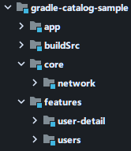

# Gradle Versions Catalog sample

This project is a showcase of different ways to use version catalogs.

## Structure

The project has different branches to see how to move from a dependency management based
on `buildSrc` to a version catalog.

### Modules

- `:app` which depends on all modules, and it should be the Android application module
- `:features:user-detail` and `:feature:users` that are modules for `Fragment`, etc.
- `:core:network` which has the network config, `Retrofit`, etc.

### Branches

- `main` Basic setup with `buildSrc` module.
- `step-1` Add the libraries and versions to the default TOML file (`libs.versions.toml`)
- `step-2` Generate accessors for all modules in the project.
- `step-3` Add libraries bundles.
- `finish` Create multiple catalogs
- `finish-kotlin-dsl` Same as `finish` branch but using Kotlin DSL to create the version catalogs
  instead of TOML files
